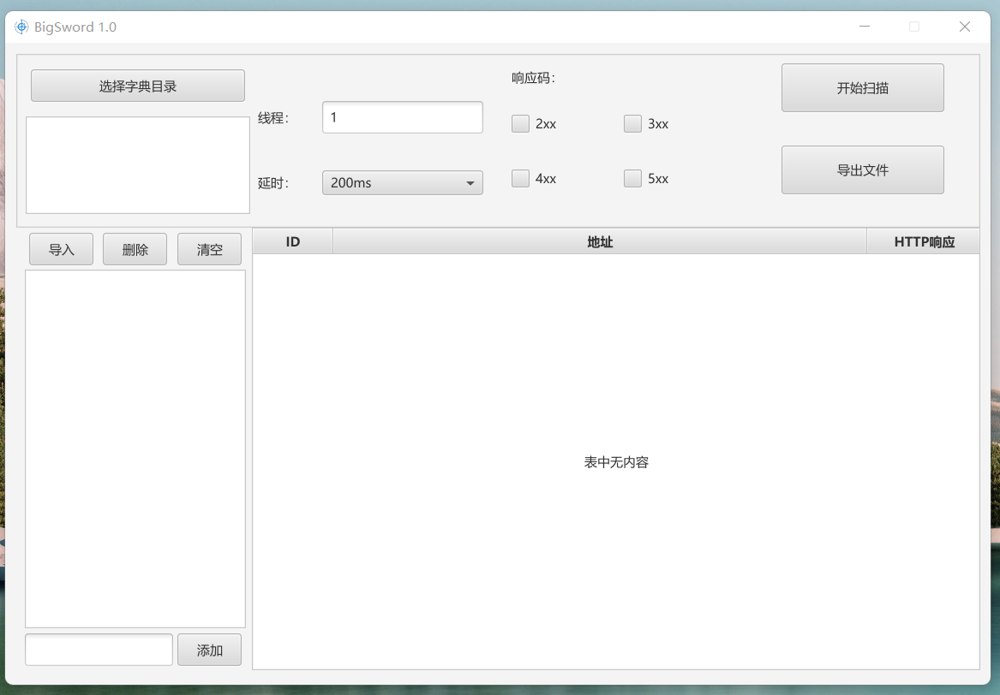
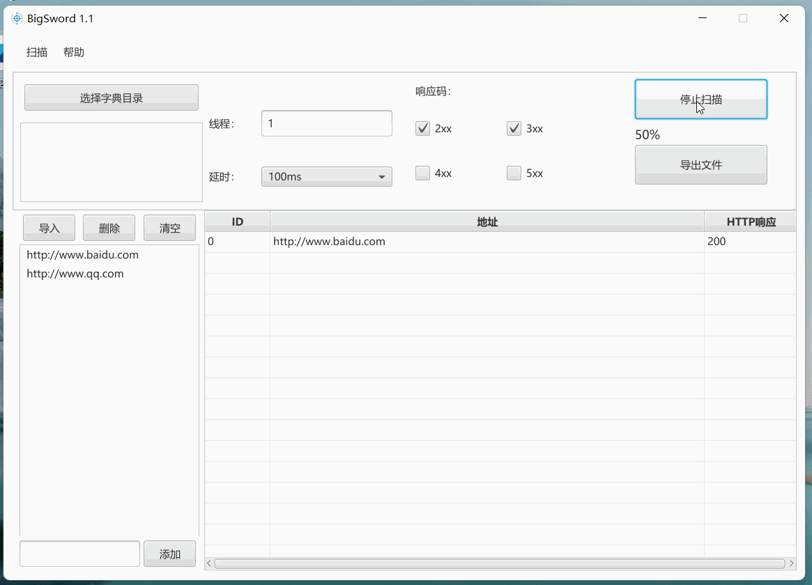
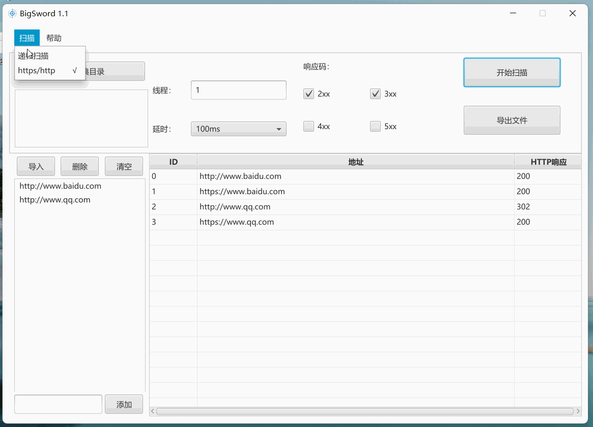

# README.md
##### 如果你有好的建议或者痛点，欢迎打扰 (联系方式文末)
### 基于JAVA的目录扫描器

### 环境
* windows 下java11及以上版本
* 本工具暂未在linux进行测试
### 使用技巧
* 扫描结果处可以通过 “ctrl + 鼠标左”打开链接
* 扫描url量过大，可先不添加字典文件，打开http/https混合进行存活扫描，后通过递归扫描添加字典
* https/http混合扫描，如果要进行递归扫描,仅第一次打开即可

### 更新历史
* 1.1版本更新
  * 更改多线程扫描方式，减少个人扫描思路
  * 增加https/http混合扫描
  
  * 增加迭代扫描功能
  
* 功能概要1.0
    * 初版本暂时仅仅实现了基本的扫描功能
    * 多线程根据自身硬件条件设置线程，线程最多不易过多，否则线程阻塞会影响扫描进度
    * 对非规则链接 如 www.github.com 仅仅会对其自动处理为 http://www.github.com
    * 扫描结果支持组合键 "ctrl + 鼠标左键单击" 打开扫描结果

* 开发中功能
    * ~~支持选择http/http混合扫描~~
    * 支持网络代理池与本地代理文件导入，设置代理更换频率与时间
    * ~~优化针对不同url链接与爆破字典比例的线程调度~~
    * 增加内部数据库，用来存放各类字典，通过响应码次数优化命中率

* 本工具会在更新完数据库相关功能后开源

#### github：
https://github.com/zlisang/BigSword

#### Wechat:

#### Mail:

Y2xvdWRzaW5AZm94bWFpbC5jb20
