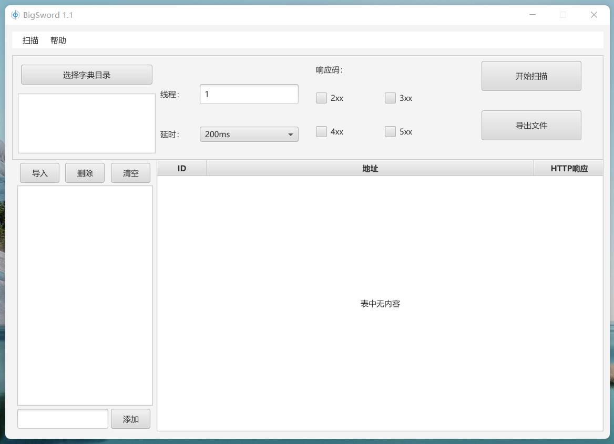

# README.md
* 基于JAVAFX的目录扫描器

* 环境
java11及以上版本
windows，本工具暂未在linux进行测试
* 功能概要1.1
    * 初版本暂时仅仅实现了基本的扫描功能
    * 多线程根据自身硬件条件设置线程，线程最多不易过多，否则线程阻塞会影响扫描进度
    * 对非规则链接 如 www.github.com 仅仅会对其自动处理为 http://www.github.com
    * 扫描结果支持组合键 "ctrl + 鼠标左键单击" 打开扫描结果

* 开发中功能
    * 支持选择http/http混合扫描
    * 支持网络代理池与本地代理文件导入，设置代理更换频率与时间
    * 优化针对不同url链接与爆破字典比例的线程调度
    * 增加内部数据库，用来存放各类字典，通过响应码次数优化命中率

声明：
    本工具会在下个版本开源
